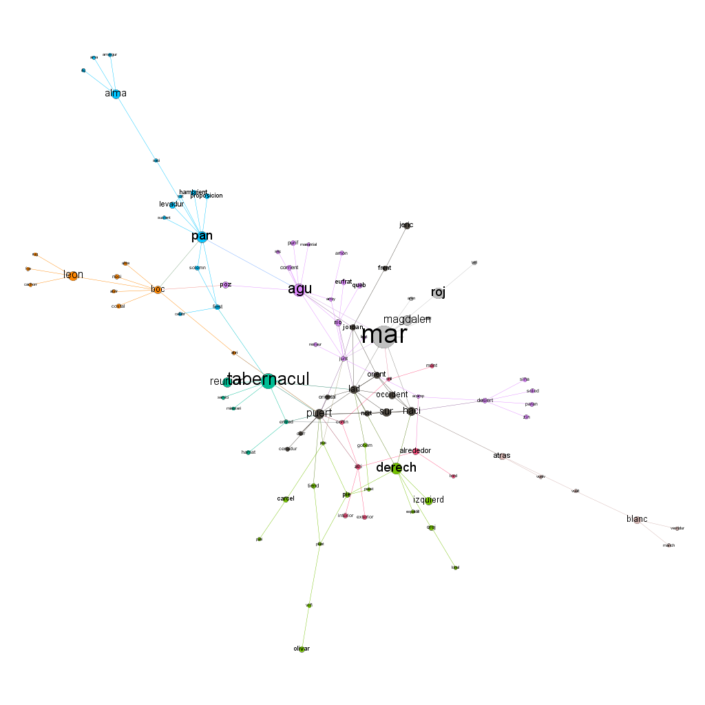
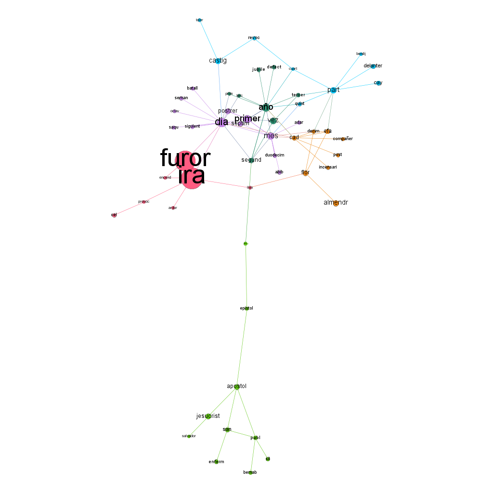

# Trabajo Mundo Interconectado

Diego Fernández López<BR>
Federico Alfaro García

## Introducción

En el presente trabajo utilizaremos las redes con el objetivo de extraer información de un texto extenso, ver las palabras relevantes y conexiones entre las mismas.<BR>
Como objeto de estudio hemos elegido la Biblia. Entre las razones de esta elección sobresalen que es fácil de conseguir, su temática es variada, carece de derechos de autor, está traducida a una gran cantidad de idiomas (lo que permitiría hacer estudios comparativos en futuros trabajos) y su larga extensión. Además está escrita en un lenguaje fácilmente comprensible lo que facilita el estudio posterior.


## Consiguiendo Datos:

El primer paso consiste en transformar el texto de la biblia en un grafo. La idea principal es considerar las palabras como nodos y los enlaces entre palabras se dan si las dos palabras aparecen seguidas.

Para ello se ha escrito código en el lenguaje Python, el cual explicamos a continuación:

Primero cargamos librerías:


```python
import os
os.chdir('files')
import time

tiempo_inic=time.clock()
import nltk#librería para el tratamiento sintáctico
from itertools import imap,ifilter,islice#tanto imap como ifilter son iteradores, son usados
               #por razones de eficiencia ver https://docs.python.org/2/library/itertools.html
import networkx as nx
from nltk.stem import SnowballStemmer
spanish_stemmer = SnowballStemmer("spanish")
#ajustamos el sistema para tratar el utf-8:
import sys
reload(sys)
sys.setdefaultencoding('utf8')
def pairwise(iterable):
    """otro iterador:(extraido de https://docs.python.org/2/library/itertools.html)
    s -> (s0,s1), (s1,s2), (s2, s3), ...
    """
    a, b = next(iterable),next(iterable),
    while 1:
        yield (a, b)
        a,b=b,next(iterable)
endphase='.!?¿!-;.:'
import stop_words
stopwords=stop_words.get_stop_words(u'spanish')#cargamos las stopwords del idioma
```

La biblia se encuentra en un fichero txt codificado en utf-8 "BIBLIA.txt", al cual aplicamos el siguiente código:


```python
text=open('BIBLIA.txt','r').read()
raw=str.decode( text,'utf8')
tokens = nltk.word_tokenize(raw,'spanish')
tokensLow=imap(unicode.lower,tokens)
from collections import defaultdict
root_original=defaultdict(set)
def getroot(original):
    root=spanish_stemmer.stem(original)
    root_original[root].add(original)
    return root
relevantWords=imap(getroot,ifilter(lambda x: not(x in stopwords), tokensLow) )
digits='01234566789&#()[]'
def punt_gestion(pairs):
    for (a,b) in pairs:
        if a in endphase or b in endphase or (a[0] in digits) or (b[0] in digits):
            pass
        else:
            yield (a,b)
parejas=(punt_gestion(pairwise(ifilter(lambda x: not(x in ','),relevantWords) )))
```

Este código lee la biblia y separa las palabras. Hay palabras que no se tienen en cuenta, las llamadas "stopwords", ya que no aportan información, como por ejemplo las preposiciones y los artículos; existen disponibles por internet estas listas de palabras, una por cada idioma. Otro tratamiento importante en este paso es que convertimos todas las palabras a su raíz, ya que no es importante diferenciar entre singular/plural, masculino/femenino o los diferentes tiempos verbales; de esta manera reducimos el número de nodos sin perfer información.

Con ayuda de la función pairwise, recorremos las palabras por parejas adyacentes, saltándonos aquellas que contengan signos que impliquen un cambio de frase.

Un ejemplo de esto sería:

###### "Examinadlo todo; retened lo bueno."

Lo que dividimos en palabras y símbolos:

###### ["examinadlo","todo", ";" ,"retened", "lo", "bueno","."]

Transformamos las palabras en sus raíces (pues así buen/o/a/s se representa por el mismo símbolo) y obviamos las stopwords:

###### ["examin","tod", ";" ,"reten",  "buen","."]

Juntamos las palabras contiguas con la función pairwise obteniendo:

###### [("examin", "tod"),("tod", ";") (";","reten") ("reten","buen") ("buen",".")]

Filtramos las parejas que contengan símbolos impliquen un cambio de frase.Resultando:

###### [("examinadlo", "todo"),("reten","buen)]

Es de resaltar que los iteradores evitan el tener que guardar las listas intermedias permitiendo una implementación más eficiente tanto en memoría como en tiempo.


Finalmente contabilizamos cuantas veces se repite cada pareja de palabras (obteniendo un diccionario (str,str)->Integer)


```python
def f(x,y):
     x[y]=1+x[y]
     return x

countParejas=reduce(f,parejas,defaultdict(int))
```

En un principio probamos a hacer un digrafo donde los nodos sean las palabras y hay un vertice $(a,b)$ si $b$ ha aparecido directamente después que $a$. Pero nos sale un grafo muy denso, por lo nos restringimos a cuando la secuencia se ha repetido al menos 5 veces:


```python
aux=ifilter(lambda x:countParejas[x]>5,countParejas)          
wordGraph=nx.DiGraph();
wordGraph.add_edges_from(aux)

```

El grafo conseguido lo guardaremos para su posterior tratamiento tanto en formato csv (tabla tipo excel) como en formato gml:


```python
nx.write_gml(wordGraph,'grafo.gml')
import pandas as pd
tabla=pd.DataFrame(wordGraph.edges(),None,['Source','Target'])
tabla.to_csv('grafo.csv')

```

## Tratamiento del Grafo:

En esta sección ya tenemos construido el grafo. En una primera aproximación extraeremos las palabras más relevantes, usando el siguiente código:


```python
from itertools import count,izip
import pandas as pd
import networkx as nx

data=pd.read_csv('grafo.csv')#cargamos el grafo en formato tabla
grafo=nx.DiGraph()
grafo.add_edges_from(zip(data['Source'],data['Target']) ) #reconstruimos el grafo desde la tabla
cuentas=pd.DataFrame()#tabla con distintas puntuaciones de nodos
cuentas['nodos']=list(grafo)
def add(func,name):
    """
    func:grafo->dict(nodos=>|R)
    name:str
    añade una nueva columna (si es que no existe) con los resultados dados por func
    """
    if name in cuentas.columns:
        pass
    else:
        sol=func(grafo)
        cuentas[name]=(map(lambda x:sol[x], cuentas['nodos']) )

def sort(columna,n=10):
    '''
    columna:str
    Devuelve una tabla con los n nodos mejor puntuados según la columna 'columna'
    '''
    mejores=sorted(zip(cuentas['nodos'],cuentas[columna],count(0)),key=lambda x:-x[1] )
    
    return cuentas.loc[map(lambda x:x[2],mejores[:10])]
add(nx.degree,'número nodos adyacentes')
add(nx.pagerank,'pagerank')
add(nx.betweenness_centrality,'centralidad')

```

Algunos estadísticos interesantes son:


```python
estadisticos={}
#numero de vértices:
estadisticos['vertices']=len(grafo)
#número de aristas:
estadisticos['aristas']=len(grafo.edges())
#clústering:
import numpy as np
estadisticos['clustering']=np.mean(nx.clustering(nx.Graph(grafo)).values() )
estadisticos
```


    {'aristas': 5500, 'clustering': 0.169398636244776, 'vertices': 1540}


Este coeficiente de clustering hay que compararlo con la probabilidad de que dos nodos sean vecinos, que es $p=\sharp aristas*2/(\sharp vertices*(\sharp vertices-1))=0.00464$. El coeficiente de cluster es mucho mayor a este $p$, por lo que nuestro grafo está muy interconectado; esto significa que dos palabras adyacentes a una tercera tienden a aparecer adyacentes entre ellas también, más de lo que cabría esperar.

Mostramos los resultados:


```python
%matplotlib inline
import matplotlib.pyplot as plt
plt.plot(sorted(cuentas['pagerank'],key=lambda x:-x),'o' )
sort('pagerank')
```


<div>
<table border="1" class="dataframe">
  <thead>
    <tr style="text-align: right;">
      <th></th>
      <th>nodos</th>
      <th>número nodos adyacentes</th>
      <th>pagerank</th>
      <th>centralidad</th>
    </tr>
  </thead>
  <tbody>
    <tr>
      <th>975</th>
      <td>hij</td>
      <td>351</td>
      <td>0.032262</td>
      <td>0.106998</td>
    </tr>
    <tr>
      <th>1055</th>
      <td>jehov</td>
      <td>326</td>
      <td>0.023401</td>
      <td>0.105755</td>
    </tr>
    <tr>
      <th>1279</th>
      <td>rey</td>
      <td>170</td>
      <td>0.016629</td>
      <td>0.038384</td>
    </tr>
    <tr>
      <th>817</th>
      <td>dios</td>
      <td>254</td>
      <td>0.016264</td>
      <td>0.056942</td>
    </tr>
    <tr>
      <th>625</th>
      <td>tierr</td>
      <td>180</td>
      <td>0.014246</td>
      <td>0.048344</td>
    </tr>
    <tr>
      <th>436</th>
      <td>cas</td>
      <td>132</td>
      <td>0.010339</td>
      <td>0.022818</td>
    </tr>
    <tr>
      <th>384</th>
      <td>dij</td>
      <td>109</td>
      <td>0.010187</td>
      <td>0.018987</td>
    </tr>
    <tr>
      <th>388</th>
      <td>dic</td>
      <td>63</td>
      <td>0.009196</td>
      <td>0.004174</td>
    </tr>
    <tr>
      <th>139</th>
      <td>tod</td>
      <td>125</td>
      <td>0.008168</td>
      <td>0.028112</td>
    </tr>
    <tr>
      <th>1210</th>
      <td>delant</td>
      <td>88</td>
      <td>0.007917</td>
      <td>0.016370</td>
    </tr>
  </tbody>
</table>
</div>


```python
plt.plot(sorted(cuentas['número nodos adyacentes'],key=lambda x:-x),'o' )
sort('número nodos adyacentes')
```


<div>
<table border="1" class="dataframe">
  <thead>
    <tr style="text-align: right;">
      <th></th>
      <th>nodos</th>
      <th>número nodos adyacentes</th>
      <th>pagerank</th>
      <th>centralidad</th>
    </tr>
  </thead>
  <tbody>
    <tr>
      <th>975</th>
      <td>hij</td>
      <td>351</td>
      <td>0.032262</td>
      <td>0.106998</td>
    </tr>
    <tr>
      <th>1055</th>
      <td>jehov</td>
      <td>326</td>
      <td>0.023401</td>
      <td>0.105755</td>
    </tr>
    <tr>
      <th>817</th>
      <td>dios</td>
      <td>254</td>
      <td>0.016264</td>
      <td>0.056942</td>
    </tr>
    <tr>
      <th>625</th>
      <td>tierr</td>
      <td>180</td>
      <td>0.014246</td>
      <td>0.048344</td>
    </tr>
    <tr>
      <th>1279</th>
      <td>rey</td>
      <td>170</td>
      <td>0.016629</td>
      <td>0.038384</td>
    </tr>
    <tr>
      <th>436</th>
      <td>cas</td>
      <td>132</td>
      <td>0.010339</td>
      <td>0.022818</td>
    </tr>
    <tr>
      <th>1063</th>
      <td>hombr</td>
      <td>128</td>
      <td>0.006439</td>
      <td>0.025643</td>
    </tr>
    <tr>
      <th>139</th>
      <td>tod</td>
      <td>125</td>
      <td>0.008168</td>
      <td>0.028112</td>
    </tr>
    <tr>
      <th>814</th>
      <td>israel</td>
      <td>123</td>
      <td>0.006778</td>
      <td>0.024241</td>
    </tr>
    <tr>
      <th>145</th>
      <td>puebl</td>
      <td>112</td>
      <td>0.007369</td>
      <td>0.015338</td>
    </tr>
  </tbody>
</table>
</div>


```python
plt.plot(sorted(cuentas['centralidad'],key=lambda x:-x),'o' )
sort('centralidad')
```


<div>
<table border="1" class="dataframe">
  <thead>
    <tr style="text-align: right;">
      <th></th>
      <th>nodos</th>
      <th>número nodos adyacentes</th>
      <th>pagerank</th>
      <th>centralidad</th>
    </tr>
  </thead>
  <tbody>
    <tr>
      <th>975</th>
      <td>hij</td>
      <td>351</td>
      <td>0.032262</td>
      <td>0.106998</td>
    </tr>
    <tr>
      <th>1055</th>
      <td>jehov</td>
      <td>326</td>
      <td>0.023401</td>
      <td>0.105755</td>
    </tr>
    <tr>
      <th>817</th>
      <td>dios</td>
      <td>254</td>
      <td>0.016264</td>
      <td>0.056942</td>
    </tr>
    <tr>
      <th>625</th>
      <td>tierr</td>
      <td>180</td>
      <td>0.014246</td>
      <td>0.048344</td>
    </tr>
    <tr>
      <th>1279</th>
      <td>rey</td>
      <td>170</td>
      <td>0.016629</td>
      <td>0.038384</td>
    </tr>
    <tr>
      <th>139</th>
      <td>tod</td>
      <td>125</td>
      <td>0.008168</td>
      <td>0.028112</td>
    </tr>
    <tr>
      <th>1063</th>
      <td>hombr</td>
      <td>128</td>
      <td>0.006439</td>
      <td>0.025643</td>
    </tr>
    <tr>
      <th>814</th>
      <td>israel</td>
      <td>123</td>
      <td>0.006778</td>
      <td>0.024241</td>
    </tr>
    <tr>
      <th>436</th>
      <td>cas</td>
      <td>132</td>
      <td>0.010339</td>
      <td>0.022818</td>
    </tr>
    <tr>
      <th>461</th>
      <td>man</td>
      <td>94</td>
      <td>0.007442</td>
      <td>0.020690</td>
    </tr>
  </tbody>
</table>
</div>


Por lo que se ve que en este caso que los tres estadísticos dan resultados similares a la hora de señalar las palabras más relevantes.

Mostramos el grafo cociente de las palabras más puntuadas:


```python
nodos=set(list(sort('número nodos adyacentes')['nodos'])+list(sort('pagerank')['nodos'])+list(sort('centralidad')['nodos']) )
print( ','.join(nodos) )
nx.draw_networkx(nx.Graph(grafo.subgraph(nodos) ))
```


Por lo que se ve una alta relación entre los nodos.

## Comunidades:
En está sección extraeremos comunidades  siguiendo distintos algoritmos, siguiendo sobre el programa anterior:


```python
from collections import defaultdict
from itertools import izip
def groupBy(columna):
    #devuelve un diccionario:valoresColumna->[Nodos]
    #                             x->[Nodos(i)|Columna(i)==x]
    def f(x,(nodo,group) ):
        x[group].append(nodo)
        return x
    return reduce(f,izip(cuentas['nodos'],cuentas[columna]),defaultdict(list))

import community#http://mlg.ucd.ie/files/summer/tutorial.pdf
add(lambda x:community.best_partition(nx.Graph(x)),'comBPart')
comunidad=groupBy('comBPart')
cuentas.to_csv('grafoFinal.csv')
```

Donde comunidad es un diccionario que asigna a cada nodo un valor en la comunidad, partiendo de esto creamos el grafo cociente:


```python
nodos=set(comunidad);
vertices={(i,j) for i in nodos for j in nodos  if (
        any(grafo.has_edge(a,b) for a in comunidad[i] for b in comunidad[j]  ) ) }
Gcomunidad=nx.Graph();Gcomunidad.add_edges_from(vertices)
layout=nx.fruchterman_reingold_layout(Gcomunidad)
nx.draw_networkx(Gcomunidad,node_size=map(lambda x:len(comunidad[x]),Gcomunidad),pos=layout)
```


```python
for n,subgraph in (imap(lambda (n,gr):(n,grafo.subgraph(gr)),comunidad.items() ) ):
    plt.figure()
    plt.title('comunidad '+str(n))
    layout=nx.layout.spectral_layout(subgraph)
    if n<=10:
        nx.write_gml(subgraph,'comunidad '+str(n))
    nx.draw_networkx(subgraph,pos=layout)
```


En el grafo el tamaño de los nodos es proporcional al número de palabras que contiene. El histograma de su tamaño es:


```python
from matplotlib.pyplot import hist
_=hist(list(filter(lambda x:x<=300,map(
                lambda x:(len(comunidad[x])),Gcomunidad ) ) ) ,bins=50
    )
```


Esto nos indica una gran cantidad de parejas de palabras repetidas (comunidades de tamaño menor o igual que 3): [salida](../Mundo%20Interconectado/out.txt)


```python
from itertools import *
f=open('out.txt','w')
f.write('\n'.join([str( (l,map(lambda x:list(root_original[x])[:3],l)) ) 
                   for l in filter(lambda x:len(x)<=3,map(lambda x:comunidad[x],Gcomunidad ) ) 
    ] ),)
f.close()
```

De esto se denota que en la biblia se tienden a repetir expresiones, pongamos algunos casos:
* huerto eden /cuidadano romano: puede considerarse un concepto unitario.
* trigo cebada: sin duda proviene de la enumeración de "trigo y cebada" por referirse a la fuente de alimentación
* entensar arco: una acción muy repetida.
* ...


## Estudiando las comunidades:

Por desgracia Python no resulta la opción más comoda ni efectiva a la hora de dibujar grandes redes. Por lo que a partir de ahora usaremos el programa Gephi.

En el código anteriormente usado hemos guardado en los archivos [grafoFinal.csv](grafoFinal.csv) y en [grafo.csv](grafo.csv) tanto el grafo como la información obtenida.

Desde el *Gephi* importamos las tablas recreando el grafo.

Sobre el grafo aplicamos el algoritmo de ForceAtlas obteniendo (doble click para verlo en toda su extensión):

[](files/Bible.svg)

Si nos fijamos en la parte inferior del grafo vemos que la comunidad azul relacciona muchos nombres propios con hijos.<BR>
En cuanto al resto de comunidades grandes las filtraremos para estudiarlas individualmente.<BR>Con ayuda de *Gephi* extraemos el subgrafo de cada comunidad de gran tamaño , calculamos el pagerank del mismo y aplicamos algoritmos de redistribución de los nodos y de modularidad.

A continuación mostraremos cada subgrafo e interpretaremos los que consideremos más interesantes:

### Comunidad 0

[](files/C0.svg)

### Comunidad 1

[](files/C1.svg)

Esta es una de las comunidades más grandes en las que se divide el grafo. Los nodos más importantes son "dios" y "Jehová", que en realidad se refieren a lo mismo en la biblia, por lo que comparten muchas conexiones. Como cabía esperar, suelen ir acompañados de términos positivos, como "bendición", "esperanza", "justicia" o "todopoderoso". En la periferia se pueden ver alguno grupos especiales: abajo a la izquierda se puede ver el nodo "si" (forma condicional) acompañado de verbos; el verbo "hacer" es bastante importante también, con conexiones diversas.

### Comunidad 2

[](files/C2.svg)

### Comunidad 3

[](files/C3.svg)

### Comunidad 4

[](files/C4.svg)

### Comunidad 5 

[](files/C5.svg)

En esta comunidad se ven claramente dos clases de palabras, relacionadas entre sí. Por un lado está el grupo de intervalos de tiempo con números, que forman expresiones referentes al paso del tiempo como "mil años" o "cuarenta días". Y por otro lado hay recursos naturales, como minerales ("oro", "plata", "bronce"), ganado ("oveja", "buey"), "madera" y "piedra".

### Comunidad 6

[](files/C6.svg)

### Comunidad 7

[](files/C7.svg)

### Comunidad 8

[](files/C8.svg)

Esta comunidad trata claramente sobre la geneología que se cuenta en la biblia. El nodo más importante de este grafo es "hij" (raíz de hijo, hija, hijos e hijas), que está conectado a muchos de los nombres que se mencionan en la biblia y al resto de nodos importantes: "padre", "hermano", "mayor" y "menor".

### Comunidad 9

[](files/C9.svg)

Esta comunidad está formada por tres pequeños grupos conectados entre sí. Arriba tenemos la palabra "fuego", acompañada por adjetivos como "consumidor" y "ardiente"; en el centro tenemos "cielo", conectado a las estrellas y la luna; y por último abajo destaca la palabra "ojos".

### Comunidad 10

[](files/C10.svg)

### Comunidad 13

[](files/C13.svg)

### Comunidad 15

[](files/C15.svg)

### Palabras autoreferentes:

Si nos fijamos, hay algunos nodos con bucles, es decir, palabras idénticas o que comparten raíz que aparecen dos veces seguidas. Esto nos puede parecer un fenómeno extraño, por lo que hemos buscado algunos ejemplos en el texto. Algunas veces se trata de que se termina una frase y se empieza la siguiente con la misma palabra y otras muchas veces son expresiones como "piedra sobre piedra", "ojo por ojo","día a día" o "por los siglos de los siglos"; estas palabras aparecen con autoenlace porque hemos eliminado las stopwords.

Para mostrar los ejemplos en su contexto hemos extraido un par de párrafos con cada caso ([script](files/repetidas.html)): [párrafos](files/extractosRep.txt)

## Conclusiones

El estudio de un texto tan extenso a través de su grafo de palabras no es sencillo. Hemos tenido que reducir la complejidad del grafo mediante algunos trucos y aún así el grafo total es demasiado grande para entenderlo en su totalidad.

Parece, al menos en este caso, relativemente fácil descubrir a los entes con mayor protagonismo (Dios/Jehová) y las distintas comunidades nos permiten ver algunas temáticas, como bien puede ser las descendencias, menciones a los materiales y tiempo, conceptos como fuego y cielo...

En este sentido se puede ver la gran variedad de temáticas en la biblia. Con un conocimiento mayor de la biblia y del contexto en la que surgió se pueden sacar conclusiones más interesantes que escapan de nuestro alcance.

Lo bueno del procedimiento seguido en este trabajo es que podemos utilizar los códigos para estudiar otros textos, pudiendo ampliar el trabajo, por ejemplo, comparando la biblia en distintos idiomas, o ver las diferencias entre un texto antiguo y uno reciente. Pudiendose así profundizar mucho más en estos estudios.

## Datos técnicos y reproducibilidad

Los códigos se han ejecutado sobre *Jupiter notebook* usando el lenguaje *Python 2.7.11*  sobre un ordenador de sobremesa con procesador *Intel (R) Core (TM) i5-2300 CPU @ 2.80GHz* con *4 GB ram*, sistema operativo *Lubuntu 64 bits (Linux)*.

En cuanto a las librerias usadas:

 * pandas 0.14.1
 * networkx 1.11
 * nltk 3.2.1
 * stop_words 2015.2.23.1
 * matplotlib
 * itertools
 * collections
 * numpy 1.11.0

Los gráficos de la sección *Estudiando comunidades* se han creado con la herramienta *Gephi* sobre el sistema descrito anteriormente.

Tiempo ejecución de los script (s):


```python
time.clock()-tiempo_inic
```


    63.356159000000005


El grafo fue construido a partir de una edición de la biblia en txt (por motivos técnicos cambiamos su codificación a UTF-8 con ayuda de un editor de texto plano):<BR>
http://www.unoenelsenor.com.ar/biblia.htm
